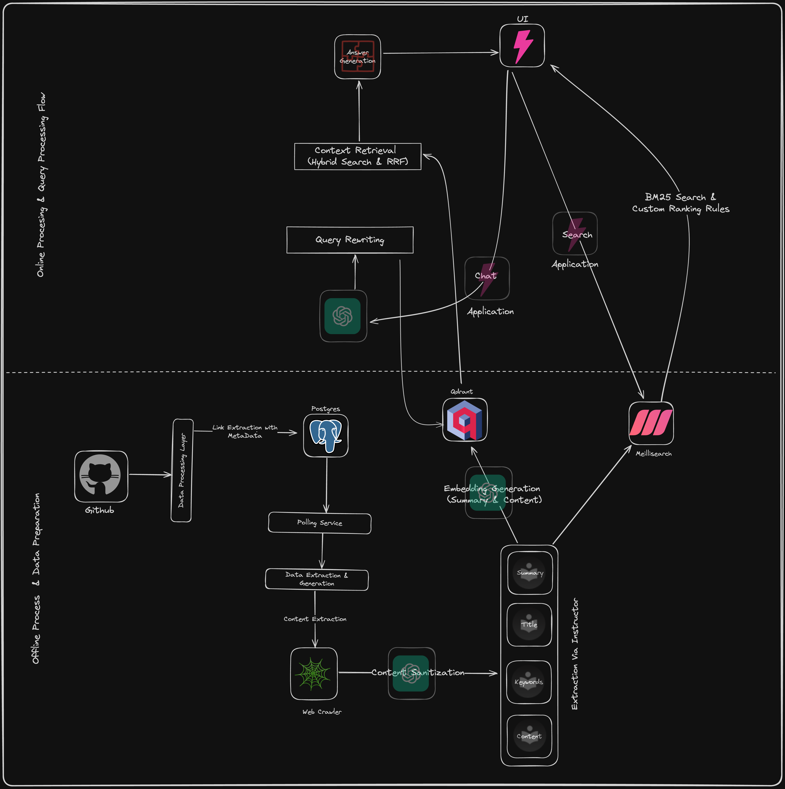

## LLM-GYM

### Installation & Usage

Make sure to setup your environment using `pyenv`. 
The project requires python 3.11 or above.

- Clone the Repository
```
git clone https://github.com/RheagalFire/LLM-gym.git
```

- Start Required Services using docker
```
docker compose up -d
```

It would start Qdrant , Meillisearch & Postgres

- Install the dependencies for gym module
```
cd gym_reader
pyenv virtualenv 3.11 gym_reader
poetry install
```
All the database schema and indexes are handled via `PRISMA` ORM.

To make your db upto the schema file run 
```
cd gym_db/gym_db
prisma db push
prisma generate
```

- Run the Services using Makefile 
```
make local
```
to start API Service

```
make indexing
```
to start indexing service. 

The webhook API Endpoint that you can use in github is `{base_url}/api/v1/github_webhook`. 

You need to configure HMAC Verification for this. 

- As a last step for starting the UI , provide proper env's and then run below commands

```
npm install 
npm start
```

### What is this? 
A personal project that helps me search & chat over my pinned links on github. 

### How is search useful? 
Search based on keywords , summary & content of the link and not just the title. 

### How is chat useful?
Read a blog and want to brainstorm or understand a particular concept of the same. The chat can help you understand or find relevant context to answer your question.

### Tech Stack 
- Postgres
- Qdrant 
- Meillisearch
- DSPY 
- Instructor
- Openai

### Orchestration 

- A Data Processing Layer that processes incoming data and dumps it to postgres. 
- An Indexing Layer which scrapes & transforms the data and dumps it to Qdrant & Meilisearch. 
- The App Engine which handles search & chat over the data. 

### How is search happening? 
- Meilisearch is used for full text search. It is based on BM25 algorithm. 
- Qdrant is used for semantic search. The Algorithm searches over summary & entire content of the link & combining the results for finding the right context to answer the user query. 


