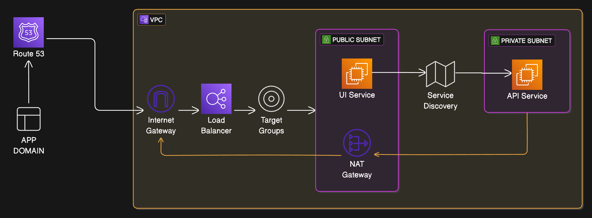

### Terraform Essentials

- Create a plan: `terraform plan -out=tfplan`
- Apply the plan: `terraform apply tfplan`

### Validating the terraform plan
- `terraform validate`
This will validate the terraform code in the current directory and its subdirectories.

